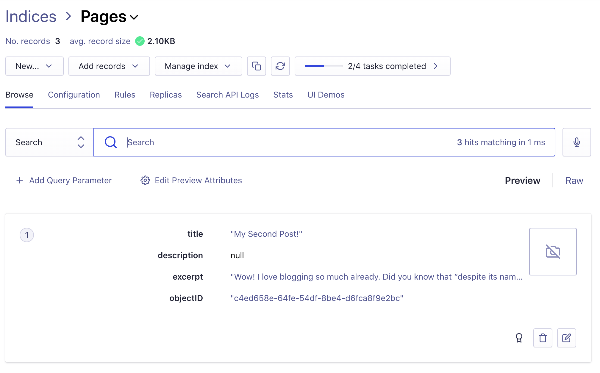
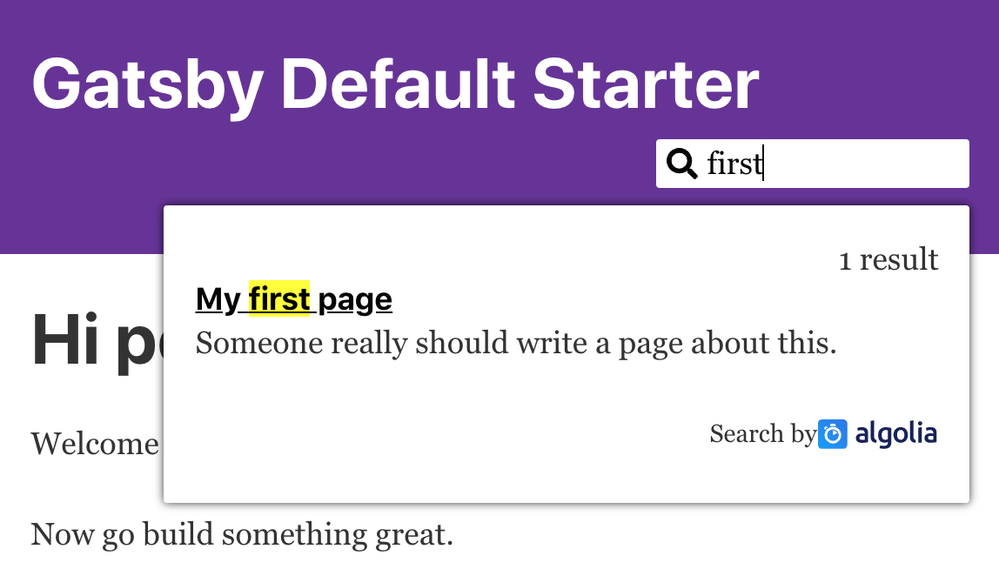
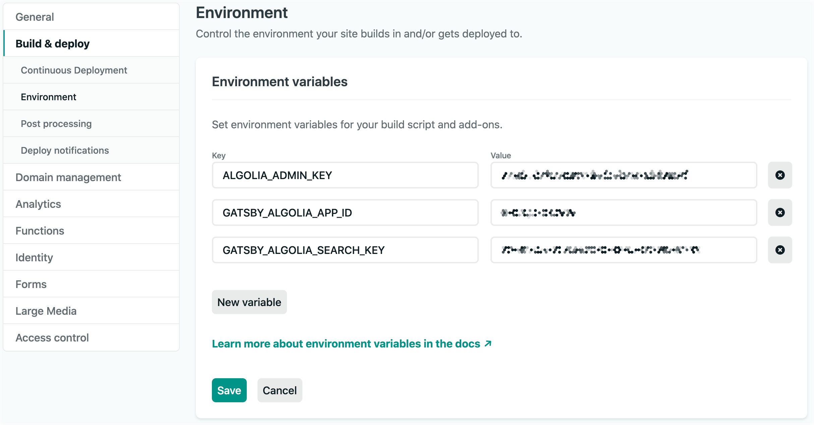

This guide will run you through the process of setting up a custom search experience powered by [Algolia](https://www.algolia.com) on a Gatsby site.

## What is Algolia?

Algolia is a site search hosting platform and API that provides you with the components you need to build powerful search functionality without setting up your own server.

Algolia will host the search index. You tell it what pages you have, where they are and how to navigate them, and the Algolia API will return those results to the user based on whatever search terms they use.

Algolia provides a free tier that offers a limited number of monthly searches. A paid plan is required for higher volumes.

## Indexing and searching

There are two stages to providing search functionality: indexing your pages and building a search interface for users to query the index.

The [Gatsby Algolia plugin](https://github.com/algolia/gatsby-plugin-algolia) handles the indexing. It sends your pages to Algolia for indexing every time you run `gatsby build`. You use GraphQL to customize which pages and what information to index.

To build the user interface for searching, this guide will use [React InstantSearch](https://www.algolia.com/doc/guides/building-search-ui/getting-started/react/), which is a library provided by Algolia with ready-made React components. This is the quickest way to get up and running, but you could also build your own custom user interface.

> Note: If you want to build a search for technical documentation, Algolia provides a product called [DocSearch](https://docsearch.algolia.com/) that simplifies the process further and eliminates the need for manual indexing. This is the preferred approach for documentation sites.

## Setting up the project

This guide will set up a search based on the [Gatsby starter blog](/starters/gatsbyjs/gatsby-starter-blog/). You can of course base it on your own project instead, but that might require minor modifications to the code, depending on your page structure and the frameworks you use.

Create a new site using

```shell
gatsby new gatsby-algolia-guide https://github.com/gatsbyjs/gatsby-starter-blog
```

The starter blog contains the pages you will index in the directory `content/blog`. These are Markdown files that have the [frontmatter field](/docs/adding-markdown-pages/#frontmatter-for-metadata-in-markdown-files) `title`. It is referenced when configuring the Algolia query. If you call this field something else, the query needs to be modified.

## Indexing

Now that you have a project set up you can proceed to indexing your pages in Algolia.

Start by adding the [Algolia plugin](https://github.com/algolia/gatsby-plugin-algolia):

```shell
npm install gatsby-plugin-algolia
```

### Configuring the Algolia plugin

You will need to provide some information that identifies your account to the Algolia plugin and authorizes it to write data to it.

If you don't already have an Algolia account, [create one](https://www.algolia.com/users/sign_up). There is a free trial that does not require a credit card.

Then, go to [the 'API Keys' section of your Algolia profile](https://www.algolia.com/api-keys). It should look like this screenshot, only with letters and numbers instead of black boxes:


Copy out the Application ID, Search-Only API Key, and Admin API Key from Algolia and create a file called `.env` in the root of your project (`gatsby-algolia-guide` if created as described above). This file contains your [project environment variables](/docs/environment-variables). Replace the placeholders with your copied values:

```text:title=.env
GATSBY_ALGOLIA_APP_ID=<App ID>
GATSBY_ALGOLIA_SEARCH_KEY=<Search-Only API Key>
ALGOLIA_ADMIN_KEY=<Admin API Key>
```

Note that the value of the Admin Key must be kept secret, since it allows write access to your index. It must therefore not be included in any code you ship.

It is also best practice not to check in the `.env` file for this reason. Consider creating an `.env.example` without the values to git instead. This way, if someone else sets up the project, they know what configuration they need to supply but don't have access to your private values.

Next, modify `gatsby-config.js` to read the configuration and add the `gatsby-plugin-algolia` plugin.

Add the following line at the top of `gatsby-config.js` to read the configuration from `.env`:

```js:title=gatsby-config.js
require("dotenv").config()
```

Then add the configuration for `gatsby-plugin-algolia` to the list of `plugin`s in the `gatsby-config.js`. `dotenv` has made the configuration values available as keys in `process.env`.

```js:title=gatsby-config.js
  plugins: [
    ... // your existing plugins here
    {
      resolve: `gatsby-plugin-algolia`,
      options: {
        appId: process.env.GATSBY_ALGOLIA_APP_ID,
        apiKey: process.env.ALGOLIA_ADMIN_KEY,
        queries: require("./src/utils/algolia-queries")
      },
    }
  ],
}
```

### Query the pages for indexing

You still need to supply a `queries` configuration. Queries tell the Algolia plugin what data is to be indexed. They perform GraphQL queries for the relevant pages and convert the response into a set of Algolia records. These contain key/value pairs with the data to be indexed.

The configuration could have been entered straight into the `gatsby-config.js`, but the configuration above loads it from a new file `src/utils/algolia-queries.js` to avoid clutter. Create this page in your project:

```js:title=src/utils/algolia-queries.js
const pagePath = `content`
const indexName = `Pages`

const pageQuery = `{
  pages: allMarkdownRemark(
    filter: {
      fileAbsolutePath: { regex: "/${pagePath.replace("/", "\\/")}/" },
    }
  ) {
    edges {
      node {
        id
        frontmatter {
          title
        }
        fields {
          slug
        }
        excerpt(pruneLength: 5000)
      }
    }
  }
}`

function pageToAlgoliaRecord({ node: { id, frontmatter, fields, ...rest } }) {
  return {
    objectID: id,
    ...frontmatter,
    ...fields,
    ...rest,
  }
}

const queries = [
  {
    query: pageQuery,
    transformer: ({ data }) => data.pages.edges.map(pageToAlgoliaRecord),
    indexName,
    settings: { attributesToSnippet: [`excerpt:20`] },
  },
]

module.exports = queries
```

If you did not start from the Gatsby start blog, you might need to modify the `pagePath` to match where your content is kept.

The file exports a list of queries. Each query defines a single index. You can build [multiple indices](https://www.algolia.com/doc/guides/sending-and-managing-data/prepare-your-data/in-depth/choosing-between-one-or-more-indices/) with Algolia but this guide will only use a single one.

Each index requires a GraphQL query that retrieves the pages and data to be indexed. A `transformer` transforms the GraphQL data to an Algolia record.

Each index has a name that identifies it. If the index does not exist, it will be created automatically during indexing.

Note that each record must have an ID in the key `objectID`. The Algolia documentation provides more information on [how to structure data into records](https://www.algolia.com/doc/guides/sending-and-managing-data/prepare-your-data/#attributes---what-to-put-in-your-record).

Here, only the field `excerpt` and the frontmatter field `title` are indexed. It will display both fields in the search results. To index more fields, add them to `pageQuery` with GraphQL.

Each query has optional [settings](https://www.algolia.com/doc/api-reference/settings-api-parameters/). The code above tells Algolia you will want to generate "snippets" of context around your hits in the `excerpt` attribute.

### Test your indexing

This should complete the indexing setup. Now run `gatsby build`. If all goes well, the output should include the following:

```shell
success Building static HTML for pages - 7.610s - 5/5 0.66/s
Algolia: 1 queries to index
Algolia: query 0: executing query
Algolia: query 0: graphql resulted in 3 records
Algolia: query 0: splitting in 1 jobs
```

Check that `graphql resulted in` is followed by the number of pages in your project. If the number is wrong, there is something wrong with your query.

Log in to your Algolia account, go to "Indices" and then select the "Page" index and you should see your indexed page data.



### Troubleshooting

If you get the error `GraphQLError: Field "fileAbsolutePath" is not defined by type MarkdownRemarkFilterInput` it means that no pages were found in your project. Check the path configured for `gatsby-source-filesystem` and the query (particularly `pagePath`).

Algolia has an upper bound of 10KB for an index entry. If you get the error `AlgoliaSearchError: Record at the position XX objectID=xx-xx-xx-xx-xx is too big size=xxxx bytes` it means you exceeded that limit. Note how the excerpts are pruned to 5000 characters in the query. Make sure you prune long fields and don't index unnecessary data.

## Adding the user interface

Now that there is data in the index, it is time to build the user interface for searching. It will display as a magnifying glass icon button that, when clicked, expands into a form field. Search results will appear in a popover below the input field as the user types.

The guide will use the following frameworks:

- [React InstantSearch](https://community.algolia.com/react-instantsearch), a component library provided by Algolia for easily building search interfaces.
- [Algolia Search](https://www.npmjs.com/package/algoliasearch) provides the API client for calling Algolia.
- [Styled Components](https://styled-components.com) for embedding the CSS in the code, integrated using the [Gatsby styled component plugin](/packages/gatsby-plugin-styled-components/).
- [Styled Icons](https://styled-icons.js.org/) provides the magnifying glass icon for the search bar.

Styled Components can also be replaced by any other CSS solution you prefer.

Install these frameworks by running the following command:

```shell
npm install react-instantsearch-dom algoliasearch styled-components gatsby-plugin-styled-components @styled-icons/fa-solid
```

### Search box

The first step is to create the input field where the user enters the search query. Algolia calls this the "search box".

```jsx:title=src/components/search/search-box.js
import React from "react"
import { connectSearchBox } from "react-instantsearch-dom"
import { Search as SearchIcon } from "@styled-icons/fa-solid"

export default connectSearchBox(
  ({ refine, currentRefinement, className, onFocus }) => (
    <form className={className}>
      <input
        className="SearchInput"
        type="text"
        placeholder="Search"
        aria-label="Search"
        onChange={e => refine(e.target.value)}
        value={currentRefinement}
        onFocus={onFocus}
      />
      <SearchIcon className="SearchIcon" />
    </form>
  )
)
```

The component consists of an HTML form containing an input field and the magnifying glass icon. Most of the work is done by Algolia's [`connectSearchBox`](https://community.algolia.com/react-instantsearch/connectors/connectSearchBox.html) function. It exposes the current search string as `currentRefinement` and a function for changing it called `refine`.

### Displaying search results

That's all there is to entering the search query. Next, build a component for displaying search results:

```jsx:title=src/components/search/search-result.js
import { Link } from "gatsby"
import { default as React } from "react"
import {
  connectStateResults,
  Highlight,
  Hits,
  Index,
  Snippet,
  PoweredBy,
} from "react-instantsearch-dom"

const HitCount = connectStateResults(({ searchResults }) => {
  const hitCount = searchResults && searchResults.nbHits

  return hitCount > 0 ? (
    <div className="HitCount">
      {hitCount} result{hitCount !== 1 ? `s` : ``}
    </div>
  ) : null
})

const PageHit = ({ hit }) => (
  <div>
    <Link to={hit.slug}>
      <h4>
        <Highlight attribute="title" hit={hit} tagName="mark" />
      </h4>
    </Link>
    <Snippet attribute="excerpt" hit={hit} tagName="mark" />
  </div>
)

const HitsInIndex = ({ index }) => (
  <Index indexName={index.name}>
    <HitCount />
    <Hits className="Hits" hitComponent={PageHit} />
  </Index>
)

const SearchResult = ({ indices, className }) => (
  <div className={className}>
    {indices.map(index => (
      <HitsInIndex index={index} key={index.name} />
    ))}
    <PoweredBy />
  </div>
)

export default SearchResult
```

Since Algolia supports multiple indices, the `SearchResult` iterates over all indices and displays hits for each of them using the `HitsInIndex` component. It, in turn, relies heavily on the [`Hits` component](https://www.algolia.com/doc/api-reference/widgets/hits/react/) from the InstantSearch library.

The `PageHit` component is responsible for displaying a single page ("hit") in a search result.

[`connectStateResults`](https://community.algolia.com/react-instantsearch/connectors/connectStateResults.html) wraps components to provide them with details about the current search such as the query, the number of results and timing statistics.

If you're using Algolia's free tier, they ask you to acknowledge the use of their technology by including the string "Powered by Algolia", which is what `PoweredBy` does.

`Highlight` and `Snippet` both display attributes of matching search results to the user. The former renders the full value whereas the latter only shows a snippet. A snippet is the text immediately surrounding the match. The `attribute` property is the name of the key in the Algolia index (as generated by `pageToAlgoliaRecord` in `algolia-queries.js`).

### Tying the search widget together

You now need to hook up the two components to each other and perform the actual search:

```jsx:title=src/components/search/index.js
import algoliasearch from "algoliasearch/lite"
import { createRef, default as React, useState } from "react"
import { InstantSearch } from "react-instantsearch-dom"
import { ThemeProvider } from "styled-components"
import StyledSearchBox from "./styled-search-box"
import StyledSearchResult from "./styled-search-result"
import StyledSearchRoot from "./styled-search-root"
import useClickOutside from "./use-click-outside"

const theme = {
  foreground: "#050505",
  background: "white",
  faded: "#888",
}

export default function Search({ indices }) {
  const rootRef = createRef()
  const [query, setQuery] = useState()
  const [hasFocus, setFocus] = useState(false)
  const searchClient = algoliasearch(
    process.env.GATSBY_ALGOLIA_APP_ID,
    process.env.GATSBY_ALGOLIA_SEARCH_KEY
  )

  useClickOutside(rootRef, () => setFocus(false))

  return (
    <ThemeProvider theme={theme}>
      <StyledSearchRoot ref={rootRef}>
        <InstantSearch
          searchClient={searchClient}
          indexName={indices[0].name}
          onSearchStateChange={({ query }) => setQuery(query)}
        >
          <StyledSearchBox onFocus={() => setFocus(true)} hasFocus={hasFocus} />
          <StyledSearchResult
            show={query && query.length > 0 && hasFocus}
            indices={indices}
          />
        </InstantSearch>
      </StyledSearchRoot>
    </ThemeProvider>
  )
}
```

The `ThemeProvider` exports variables for the CSS to use (this is the [theming](https://styled-components.com/docs/advanced#theming) functionality of `styled-components`). If you are using `styled-components` elsewhere in your project you probably want to place it at the root of your widget hierarchy rather than in the search widget itself.

The `hasFocus` variable tracks whether the search box is currently in focus. When it is, it should display the input field (if not, only the search icon button is visible).

`StyledSearchRoot` is the root of the whole component. The React hook `useClickOutside` provides a callback if the user clicks anywhere else on the page, in which case it should close.

`InstantSearch` from [`react-instantsearch-dom`](https://community.algolia.com/react-instantsearch) wraps the search box and search results to orchestrate the search.

### Supporting files

Almost done! Only some supporting files left. You need to add the implementation of the `useClickOutside` hook:

```jsx:title=src/components/search/use-click-outside.js
import { useEffect } from "react"

const events = [`mousedown`, `touchstart`]

export default (ref, onClickOutside) => {
  const isOutside = element => !ref.current || !ref.current.contains(element)

  const onClick = event => {
    if (isOutside(event.target)) {
      onClickOutside()
    }
  }

  useEffect(() => {
    for (const event of events) {
      document.addEventListener(event, onClick)
    }

    return () => {
      for (const event of events) document.removeEventListener(event, onClick)
    }
  })
}
```

And finally, you should also add some CSS. The `Styled` components wrap the components you wrote earlier to add styling to them. If you wish to use a different CSS framework, you can skip these. In that case, replace `StyledSearchBox` with `SearchBox`, `StyledSearchResult` with `SearchResult` and `StyledSearchRoot` with `<div>` in `index.js`.

```jsx:title=src/components/search/styled-search-root.js
import styled from "styled-components"

export default styled.div`
  position: relative;
  margin: 0.6em 0;
`
```

The root element needs relative positioning so you can position the popover underneath it.

```jsx:title=src/components/search/styled-search-box.js
import styled, { css } from "styled-components"
import SearchBox from "./search-box"

const open = css`
  width: 10em;
  background: ${({ theme }) => theme.background};
  cursor: text;
  margin-left: -1.6em;
  padding-left: 1.6em;
`

const closed = css`
  width: 0;
  background: transparent;
  cursor: pointer;
  margin-left: -1em;
  padding-left: 1em;
`

export default styled(SearchBox)`
  display: flex;
  flex-direction: row-reverse;
  align-items: center;
  margin-bottom: 0;

  .SearchInput {
    outline: none;
    border: ${({ hasFocus }) => (hasFocus ? "auto" : "none")};
    font-size: 1em;
    transition: 100ms;
    border-radius: 2px;
    color: ${({ theme }) => theme.foreground};
    ::placeholder {
      color: ${({ theme }) => theme.faded};
    }
    ${({ hasFocus }) => (hasFocus ? open : closed)}
  }

  .SearchIcon {
    width: 1em;
    margin: 0.3em;
    color: ${({ theme }) => theme.foreground};
    pointer-events: none;
  }
`
```

The `SearchBox` has an open and a closed state. The `hasFocus` property determines which state the component is in. `open` and `closed` contain the CSS that is different for the two states.

Finally, add some styling to the search result:

```jsx:title=src/components/search/styled-search-result.js
import styled, { css } from "styled-components"
import SearchResult from "./search-result"

const Popover = css`
  max-height: 80vh;
  overflow: scroll;
  -webkit-overflow-scrolling: touch;
  position: absolute;
  z-index: 2;
  right: 0;
  top: 100%;
  margin-top: 0.5em;
  width: 80vw;
  max-width: 30em;
  box-shadow: 0 0 5px 0;
  padding: 1em;
  border-radius: 2px;
  background: ${({ theme }) => theme.background};
`

export default styled(SearchResult)`
  display: ${props => (props.show ? `block` : `none`)};
  ${Popover}

  .HitCount {
    display: flex;
    justify-content: flex-end;
  }

  .Hits {
    ul {
      list-style: none;
      margin-left: 0;
    }

    li.ais-Hits-item {
      margin-bottom: 1em;

      a {
        color: ${({ theme }) => theme.foreground};

        h4 {
          margin-bottom: 0.2em;
        }
      }
    }
  }

  .ais-PoweredBy {
    display: flex;
    justify-content: flex-end;
    font-size: 80%;

    svg {
      width: 70px;
    }
  }
`
```

`Popover` creates a popover floating under the search box. The `show` property determines whether it is visible or not.

## Usage

The search widget is now ready for use. It needs to be placed somewhere in your project's layout. If you start from Gatsby starter block, you can use the `layout` component:

```jsx:title=src/components/layout.js
import React from "react"
import { Link } from "gatsby"
import { rhythm, scale } from "../utils/typography"
// highlight-start
import Search from "./search"

const searchIndices = [{ name: `Pages`, title: `Pages` }]
// highlight-end

const Layout = ({ location, title, children }) => {
  // ...

  return (
    <div
      style={{
        marginLeft: `auto`,
        marginRight: `auto`,
        maxWidth: rhythm(24),
        padding: `${rhythm(1.5)} ${rhythm(3 / 4)}`,
      }}
    >
      <header>
        // highlight-next-line
        <Search indices={searchIndices} />
        {header}
      </header>
      <main>{children}</main>
      <footer>
        © {new Date().getFullYear()}, Built with
        {` `}
        <a href="https://www.gatsbyjs.org">Gatsby</a>
      </footer>
    </div>
  )
}

export default Layout
```

If you started from a different project your layout may look different; the highlighted lines show which lines need to be added.

Note that this is where you define the search indices you wish to search. They are passed as a property to `Search`.

## Running

Running `gatsby develop` should now give you a working search that looks something like this:



You can also play around with it at [https://janosh.io/blog](https://janosh.io/blog).

## Deploying to Netlify

If you try to deploy the project to Netlify, the deployment will fail with the error `AlgoliaSearchError: Please provide an application ID`. This is because Netlify does does not have access to the Algolia configuration. Remember, it is kept in the `.env` file which is not checked in.

You therefore need to declare the same environment variables you put in `.env` in Netlify. Go to your Netlify site dashboard under **Settings > Build & deploy > Environment > Environment variables** and enter the keys `GATSBY_ALGOLIA_APP_ID`, `GATSBY_ALGOLIA_SEARCH_KEY` and `ALGOLIA_ADMIN_KEY` with the same values as you used in the `.env` file. After a redeploy, the search should now work!



The Netlify documentation has more information on [how to configure environment variables in Netlify](https://docs.netlify.com/configure-builds/environment-variables/#declare-variables). Also see the chapter [Environment Variables](/docs/environment-variables) for an overview of environment variables in Gatsby.

## Additional Resources

If you have any issues or if you want to learn more about using Algolia for search, check out this tutorial from Jason Lengstorf:

https://youtu.be/VSkXyuXzwlc

You can also find stories of companies using Gatsby + Algolia together [in the Algolia section of the blog](/blog/tags/algolia).
